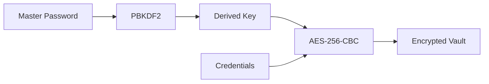

# 🔐 Secure CLI Password Manager

A robust command-line password manager built with modern C++ that provides military-grade encryption for your credentials. This tool helps you securely store and manage passwords with a focus on security, simplicity, and reliability.

## 📑 Table of Contents
- [Features](#-features)
- [Technology Stack](#-technology-stack)
- [Project Structure](#-project-structure)
- [Security Architecture](#-security-architecture)
- [Installation](#-installation)
- [Usage Guide](#-usage-guide)
- [Development](#-development)
- [Security Considerations](#-security-considerations)
- [Contributing](#-contributing)

## ✨ Features

### Core Security
- 🔒 AES-256-CBC encryption for all stored data
- 🔑 PBKDF2 key derivation (100,000 iterations)
- 🎲 Cryptographically secure random number generation
- 🧹 Secure memory wiping after use
- ⏰ Automatic vault locking after inactivity

### User Features
- 📝 Add and update service credentials
- 🔍 Quick password retrieval
- 📋 List all stored services
- 🗑️ Remove unwanted credentials
- 🎲 Generate strong random passwords
- 📊 Password strength analysis
- 📎 Clipboard integration (macOS)

## 🛠 Technology Stack

### Core Technologies
- **C++17**: Modern, efficient, and type-safe programming
  - Why: Performance, memory control, and robust standard library
  - Features used: STL containers, RAII, smart pointers

- **OpenSSL**: Industry-standard cryptographic library
  - Why: Battle-tested encryption algorithms and extensive security features
  - Components: EVP API, AES-256, PBKDF2

- **POSIX Threading**: Multi-threaded architecture
  - Why: Non-blocking auto-lock functionality
  - Features: Background monitoring, atomic operations

### Build System
- **Make**: Cross-platform build automation
  - Why: Widespread support, simple configuration
  - Features: Conditional compilation, dependency management

## 📁 Project Structure

### Source Files
1. `crypto.hpp` / `crypto.cpp`
   - Purpose: Cryptographic operations
   - Features:
     - AES-256 encryption/decryption
     - Key derivation (PBKDF2)
     - Secure random generation
   - Why: Isolates security-critical code

2. `vault.hpp` / `vault.cpp`
   - Purpose: Credential management
   - Features:
     - Secure storage format
     - CRUD operations
     - Serialization
   - Why: Separates data management logic

3. `main.cpp`
   - Purpose: CLI interface
   - Features:
     - Command processing
     - Auto-lock implementation
     - User interaction
   - Why: Entry point and UI logic

### Support Files
4. `Makefile`
   - Purpose: Build configuration
   - Features:
     - Cross-platform compilation
     - Development/release targets
     - Dependency management
   - Why: Automated build process

5. `test_basic.sh`
   - Purpose: Basic functionality testing
   - Features:
     - Binary verification
     - OpenSSL linking check
     - File operations test
   - Why: Quick validation of core features

6. `demo.md`
   - Purpose: Quick start guide
   - Features:
     - Common commands
     - Usage examples
     - Feature demonstrations
   - Why: User onboarding

## 🔒 Security Architecture

### Encryption Flow


### Data Storage Format
```
vault.dat
├── Authentication Block
│   ├── Salt (16 bytes)
│   ├── IV (16 bytes)
│   └── Verification Data
└── Encrypted Credentials
    ├── Service Names
    ├── Usernames
    └── Passwords
```

## 📥 Installation

### Prerequisites
- C++17 compatible compiler
- OpenSSL development libraries
- Make build system

### macOS
```bash
# Install dependencies
brew install openssl

# Build
make install-deps-mac
make
```

### Ubuntu/Debian
```bash
# Install dependencies
sudo apt-get update
sudo apt-get install libssl-dev build-essential

# Build
make install-deps-ubuntu
make
```

### CentOS/RHEL
```bash
# Install dependencies
sudo yum install openssl-devel gcc-c++ make

# Build
make install-deps-centos
make
```

## 🚀 Usage Guide

### First Time Setup
```bash
# Start the password manager
./password_manager

# Follow prompts to:
# 1. Create master password
# 2. Initialize vault
# 3. Begin adding credentials
```

### Common Commands
```bash
# Add new credential
🔐 > add

# Retrieve password
🔐 > get

# List all services
🔐 > list

# Generate password
🔐 > generate

# Check vault status
🔐 > status
```

## 💻 Development

### Build Options
```bash
make              # Standard build
make debug        # Debug build
make release      # Optimized build
make clean        # Clean artifacts
```

### Security Testing
```bash
make security-check  # Static analysis
make memcheck       # Memory leak check
```

### Code Style
- Modern C++ practices
- RAII principles
- Exception safety
- Resource management

## 🛡️ Security Considerations

### Master Password
- Use strong, unique master password
- Regular password rotation
- No password recovery (by design)

### System Security
- Keep OpenSSL updated
- Use system encryption
- Regular backups
- Secure terminal

## 🤝 Contributing

1. Fork repository
2. Create feature branch
3. Add security tests
4. Submit pull request

### Development Guidelines
- Follow existing code style
- Add unit tests
- Document security implications
- Update README as needed

## 📄 License

This project is released under the MIT License. See LICENSE file for details.

## ⚠️ Disclaimer

This software is provided "as is" without warranty. While designed with security best practices, no software is 100% secure. Use responsibly and maintain proper backups.

---

Made with ❤️ by [Amar Kumar](mailto:amar.edu09@gmail.com)

Remember: Security is a journey, not a destination. Keep your software updated! 